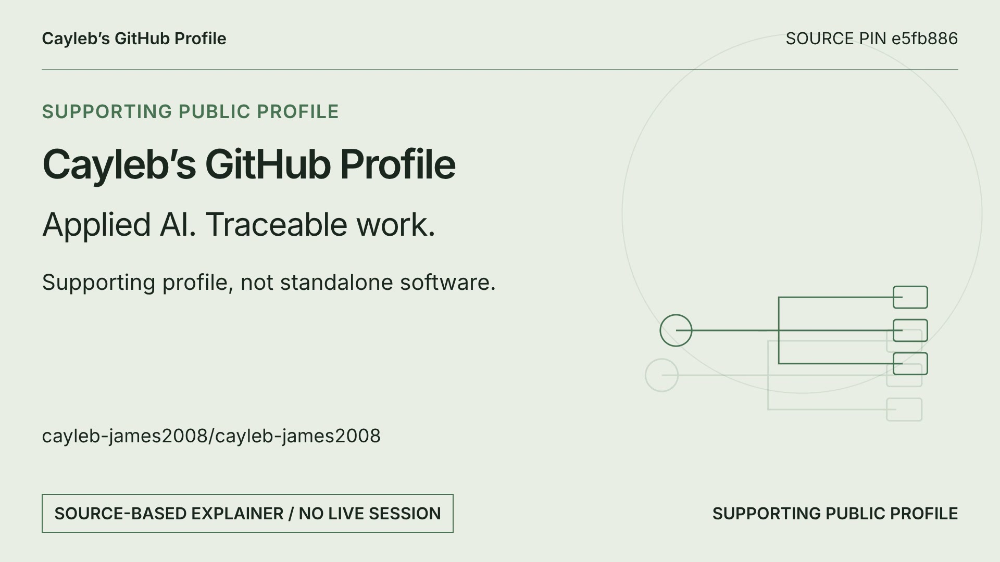

# Profile explainer

The 20-second silent video explains this supporting profile repository. It uses original explanatory graphics and a public README excerpt; it shows no live application session and makes no adoption or deployment claim.

The source is [README.md at `e5fb886`](https://github.com/cayleb-james2008/cayleb-james2008/blob/e5fb8867bf1a71f4e4de313e09cdf42e471c1f01/README.md), captured for the 7 October 2026 source baseline. The video retains that historical source pin. The current profile’s project links provide their own evidence and limits.

Created with [Brag](https://github.com/latent-spaces/brag) and HyperFrames. The rendered media uses original SVG geometry and Inter under its SIL Open Font License; no borrowed image or video appears. The explainer is documentation, not a separate software project.
